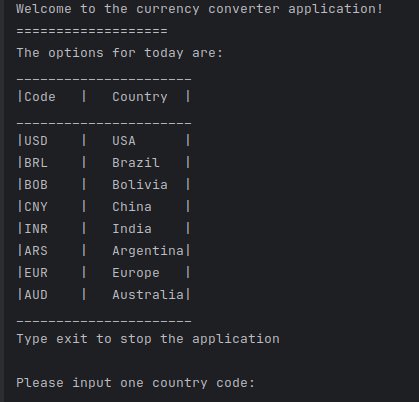
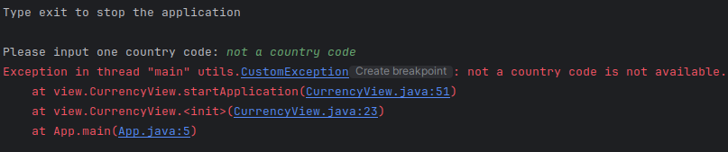
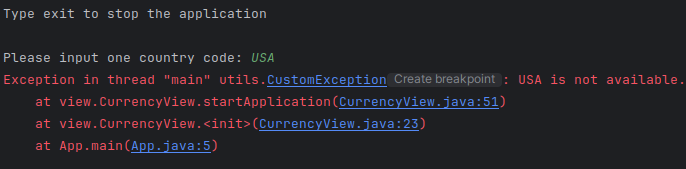
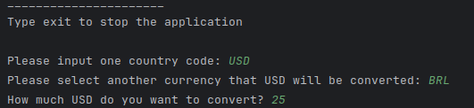
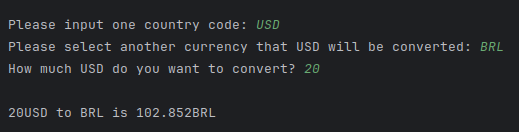

# Currency Converter Application

## Overview
This is a simple currency converter application that allows users to convert between different currencies. It utilizes an external API to fetch currency conversion rates and provides a command-line interface for user interaction.

## Usage
1. Run the `App` class to start the application.
2. Follow the on-screen instructions to input the desired currencies and quantities for conversion.
3. The application will display the converted value and save the conversion history.
4. Type "exit" to close the application.

## Features
- Convert between various currencies such as USD, BRL, BOB, CNY, INR, ARS, EUR, AUD.
- Input validation to ensure only valid currency codes are accepted.
- Error handling for invalid inputs and API connection failures.
- Conversion history saved in a text file (`search_history.txt`).

## Code Structure
- **`App` class:** Entry point of the application, responsible for initializing the `CurrencyView`.
- **`CurrencyView` class:** Handles user input and interaction, delegates currency conversion to `CurrencyController`.
- **`CurrencyController` class:** Manages currency conversion logic, interacts with the external API, and saves conversion history.
- **`Currency` class:** Represents a currency object with details like code, quantity, conversion rate, and date.
- **`CurrencyApiResponse` class:** Models the response structure from the external currency API.
- **`CustomException` class:** Custom exception class for handling application-specific errors.
- **Test cases:** Includes unit tests for model creation, currency conversion, currency availability, and API response validation.

## Dependencies
- Gson library for JSON parsing.
- JUnit for unit testing.

## Notes
- Replace the `apiKey` variable in `CurrencyController` with a valid API key for the currency conversion API.
- Ensure proper error handling and input validation for production use.
- This readme serves as a quick reference; detailed documentation can be added as needed.

## Contributors
- [Gabriel]

## Application

---

---

---

---

